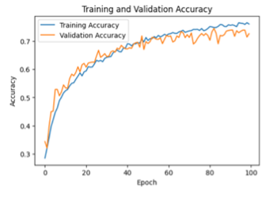

# Optimizing EEG Signal Classification Through Advanced Deep Learning Architectures

This project aims to optimize the classification of EEG signals within the realm of Brain-Computer Interaction (BCI) by leveraging advanced deep learning architectures. We explored a combination of deep learning architectures and implemented preprocessing techniques to enhance the accuracy and robustness of our models. Here are the main technologies and architectures employed:

- **Deep Learning Architectures**: Our study involved various deep learning architectures, including Convolutional Neural Networks (CNNs), Recurrent Neural Networks (RNNs), Convolutional Recurrent Neural Networks (CRNNs), and a Deep Temporal-Spatial Convolutional GRU (DTS-ConvGRU).

Training and Validation Performance of DTS-ConvGRU

- **Preprocessing Techniques**: To improve data quality and model performance, we utilized data augmentation and preprocessing techniques, notably Variational Autoencoders (VAEs) for generating synthetic data that closely resembles the original EEG data.

- **Data Augmentation**: We implemented several data augmentation techniques such as subsampling, window averaging, max pooling, average pooling, and the addition of Gaussian noise, along with synthetic data generated using VAEs, to expand our training set and improve the models' generalization capabilities.

EEG Signal Representation of a Selected Channel from 22 Electrodes

Enhanced EEG Signal Generation via VAE-CNN

Enhanced EEG Signal Generation via VAE-CRNN

## Results Overview

- **Best Performance with DTS-ConvGRU**: Among all the architectures tested, the DTS-ConvGRU model demonstrated the best performance, achieving a test accuracy of 72.18%, proving its effectiveness in handling EEG signal classification tasks.
- **Performance of Other Architectures**: Besides DTS-ConvGRU, the SpatialCNN and ConvLSTM models also showed similar high performance, with test accuracies of 71.11% and 71.16%, respectively. This indicates that architectures combining CNNs and RNNs have potential in EEG signal classification tasks.
- **Impact of Data Augmentation**: By using synthetic EEG data generated with VAEs, we were able to further enhance the robustness and accuracy of the models. Although this approach had limited improvement for simple CNN architectures, for more complex models like DTS-ConvGRU, the use of synthetic data was not as effective as the original data.

Model Performance (all preprocessing applied) 

| Model          | Val Acc | Test Acc   |
| -------------- | ------- | ---------- |
| Vanilla CNN    | 86.52%  | 64.84%     |
| 3 Layer CNN    | 81.64%  | 70.65%     |
| ShallowConvNet | 93.22%  | 67.95%     |
| Vanilla RNN    | 82.03%  | 32.62%     |
| DTS-ConvGRU    | 72.60%  | **72.18%** |
| ConvLSTM       | 69.87%  | 71.16%     |
| SpatialCNN     | 92.83%  | 71.11%     |

VanillaRNN’s Performance on preprocessing methods

| Model          | Val Acc | Test Acc |
| -------------- | ------- | -------- |
| All methods    | 82.03%  | 32.62%   |
| Subsampling    | 54.10%  | 30.36%   |
| Gaussian Noise | 30.28%  | 28.22%   |
| Pooling        | 81.86%  | 32.28%   |
| Trimming       | 26.81%  | 31.60 %  |
| Window Avg     | 27.12%  | 26.07%   |
| Normalization  | 24.86%  | 27.50%   |
| No preprocess  | 31.23%  | 30.24%   |

Comparison of VanillaRNN Model Accuracy with Real and VAE-Synthesized Data

| VanillaRNN | Val Acc | Test Acc   |
| ---------- | ------- | ---------- |
| Real Data  | 97.40%  | 59.09%     |
| VAE-CNN    | 94.88%  | 59.08%     |
| VAE-CRNN   | 95.98%  | **63.43%** |

Comparison of DTS-ConvGRU Model Accuracy with Real and VAE-Synthesized Data

| DTS-ConvGRU | Val Acc | Test Acc   |
| ----------- | ------- | ---------- |
| Real Data   | 86.21%  | 71.90%     |
| VAE-CNN     | 86.37%  | 69.75%     |
| VAE-CRNN    | 89.36%  | **72.29%** |

## Conclusion

This project demonstrates the potential application of deep learning technologies in EEG signal classification, especially through the combination of advanced architectures and data augmentation techniques to improve classification performance. The success of the DTS-ConvGRU model highlights the importance of deep temporal-spatial feature extraction in handling complex brain electrical data. Additionally, the application of Variational Autoencoders for data augmentation opens new directions for future research, although caution is needed when using synthetic data to ensure the optimal performance of classification models.
